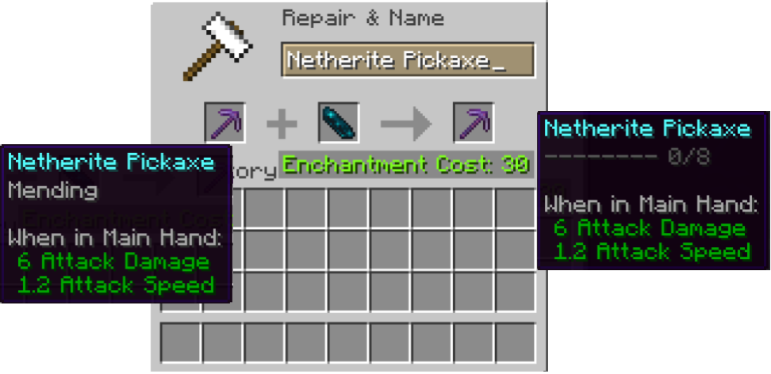
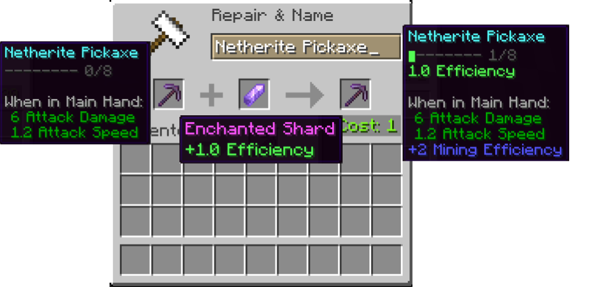

# TFA Tools

An enchantment overhaul. Requires Fabric. Install on the server, compatible with vanilla clients.

## Basics

Combine a tool with mending with an echo shard in an anvil to opt-in to the overhaul.

Once opted-in, combine the tool with Enchanted Shards in an anvil.
Only tools, swords, and armor are supported.
Enchanted Shards can be found in most generated structures with a strength from +1.0 to +1.5,
where 1.0 corresponds to 1 level of a Vanilla enchantment.

Grindstone the tool to obtain a refund of all shards used.

## Details

Slots are the basic mechanic that limits how many shards you
can put into a tool.

| Material  | Swords | Other tools | Armor |
|-----------|--------|-------------|-------|
| Copper    | 3      | 3           | 3     |
| Iron      | 4      | 4           | 3     |
| Gold      | 10     | 10          | 5     |
| Diamond   | 7      | 7           | 4     |
| Netherite | 8      | 8           | 4     |

The lower-than-diamond materials have unique abilities:
- Copper is able to ignore all strength caps.
- Iron gives a free +0.2 to strength to all shards inserted into it.
- Gold has more slots that any other material (this is reflected in the table).

All opted-in items always have Mending and Unbreaking 3.
Caps on armor will apply to all 

| ID | Enchantment     | Binary | Slot Usage | Strength Cap | Notes                      |
|----|-----------------|--------|------------|--------------|----------------------------|
| 0  | Efficiency      | No     | 1          |              |                            |
| 1  | Silk Touch      | Yes    | 2          |              |                            |
| 2  | Fortune         | No     | 1          | 3.0          |                            |
| 3  | Durability      | No     | 1          |              |                            |
| 4  | Sharpness       | No     | 1          | 5.0          | Cap shared with flintslate |
| 5  | Flintslate      | Yes    | 1          | 5.0          | Cap shared with sharpness  |
| 6  | Knockback       | No     | 1          | 2.0          |                            |
| 7  | Blunt Prot      | No     | 1          | 9.0          |                            |
| 8  | Blade Prot      | No     | 1          | 9.0          |                            |
| 9  | Fire Prot       | No     | 1          | 9.0          |                            |
| 10 | Blast Prot      | No     | 1          | 9.0          |                            |
| 11 | Proj Prot       | No     | 1          | 9.0          |                            |
| 12 | Magic Prot      | No     | 1          | 9.0          |                            |
| 13 | Feather Falling | No     | 1          | 6.0          |                            |
| 14 | Aqua Affinity   | Yes    | 1          |              |                            |
| 15 | Soul Speed      | Yes    | 1          |              |                            |
| 16 | Swift Sneak     | Yes    | 1          |              |                            |
| 17 | Frost Walker    | Yes    | 1          |              |                            |

Descriptions:
- Durability: Adds 5% on top of the base 75% chance not to consume durability given by unbreaking.
- Flintslate: Is considered fire damage, but does not light targets on fire
- Fortune: Includes looting as well
- Aqua Affinity: Includes respiration 3 as well, or depth strider 3 if put on boots
Besides these, all enchantments function equivalently to their vanilla counterparts.